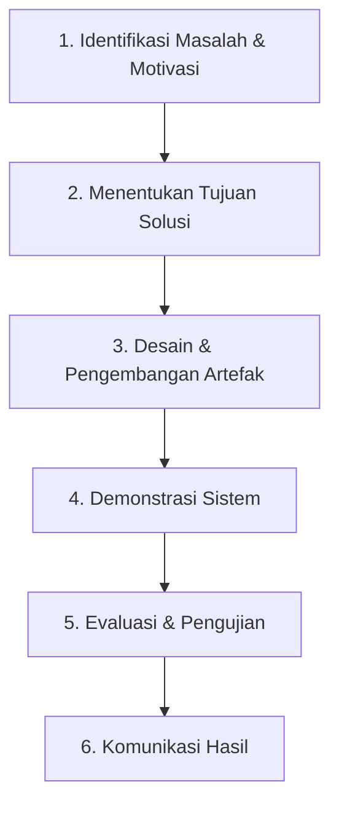

# RANCANGAN METODE DESIGN SCIENCE RESEARCH (DSR)

**Kerangka Kerja:** Kerangka Riset Peffers, Tuunanen, Rothenberger, & Chatterjee (2007)  
**Tujuan Penelitian:** Pengembangan dan Evaluasi Aplikasi PageSpeed Monitor & OJS Secure  

---

## 1. Pengantar Design Science Research (DSR)
Penelitian ini menggunakan kerangka kerja *Design Science Research* (DSR). DSR berfokus pada penciptaan dan evaluasi artefak teknologi (berupa algoritma, model, metode, atau implementasi perangkat lunak) yang bertujuan untuk memecahkan masalah praktis organisasi yang diidentifikasi secara spesifik.

---

## 2. Enam Tahap Siklus DSR Peffers et al. (2007)
Berikut adalah penerapan enam tahap metode DSR dalam pengembangan sistem PageSpeed Monitor dan modul OJS Secure:

### Tahap 1: Identifikasi Masalah & Motivasi (Problem Identification & Motivation)
* **Kegiatan:** Mengidentifikasi masalah pengelolaan puluhan website jurnal ilmiah di CV Syntax Corporation Indonesia. Tim IT Maintenance kesulitan memantau penurunan kinerja web secara cepat karena pengecekan PageSpeed masih manual. Di samping itu, penyimpanan kredensial login admin OJS dalam database biasa tanpa otentikasi lapis kedua beresiko tinggi terhadap keamanan.
* **Hasil:** Dokumentasi masalah operasional dan urgensi pembuatan sistem keamanan kredensial OJS terenkripsi dengan sesi terisolasi.

### Tahap 2: Menentukan Tujuan Solusi (Define Objectives for a Solution)
* **Kegiatan:** Merumuskan spesifikasi sistem untuk mengatasi masalah di atas. Tujuan utama adalah membangun sistem yang mengintegrasikan penarikan skor PageSpeed secara otomatis via API Google, enkripsi data sensitif (AES-256), serta pembatasan hak akses kredensial menggunakan sesi token jangka pendek (30 menit).
* **Hasil:** Dokumen Spesifikasi Kebutuhan Sistem (BRD) dan rancangan arsitektur keamanan informasi.

### Tahap 3: Desain & Pengembangan (Design & Development)
* **Kegiatan:** Mengembangkan kode program sesuai arsitektur yang direncanakan.
  * **Backend (Laravel):** Membuat controller `OjsSecureController.php` untuk menangani endpoint `/api/ojs-secure/authenticate` (generate token sesi), `verify` (verifikasi token), dan `getInstances` (ambil data dengan enkripsi terproteksi). Serta skema database migrasi untuk tabel `ojs_secure_sessions`.
  * **Frontend (React + TS):** Membangun komponen antarmuka `OjsSecure.tsx` yang menyimpan token sesi di `localStorage`, mengirimkan token sesi melalui header kustom `X-OJS-Session` ke backend, dan menangani redirect otomatis jika otentikasi kedaluwarsa.
* **Hasil:** Source code aplikasi web, skema database, dan integrasi API.

### Tahap 4: Demonstrasi (Demonstration)
* **Kegiatan:** Mendemonstrasikan fungsionalitas artefak dalam lingkungan uji coba. Uji coba dilakukan dengan menjalankan sistem secara lokal menggunakan skenario:
  1. Melakukan login ke sistem utama.
  2. Mengakses halaman OJS Secure dan memasukkan kredensial master OJS Secure.
  3. Mengubah data kredensial salah satu instansi OJS dan memastikan data tersimpan ke database.
  4. Menunggu selama 30 menit untuk menguji apakah sesi otomatis logout (*session timeout*).
* **Hasil:** Log pengujian dan demo aplikasi web yang berfungsi dengan baik.

### Tahap 5: Evaluasi (Evaluation)
* **Kegiatan:** Mengukur kinerja artefak terhadap tujuan solusi yang telah ditetapkan pada Tahap 2.
  * **Evaluasi Teknis:** Melakukan uji coba performa API (response time), tingkat keberhasilan sinkronisasi sesi ganda (Laravel Sanctum + OJS Secure), dan keandalan enkripsi database.
  * **Evaluasi Usability:** Menyebarkan kuesioner *System Usability Scale (SUS)* kepada 5 staf IT Maintenance yang menggunakan sistem untuk mengukur kemudahan penggunaan dasbor.
* **Hasil:** Nilai rata-rata skor SUS, analisis waktu respon API, dan laporan keamanan enkripsi data.

### Tahap 6: Komunikasi (Communication)
* **Kegiatan:** Mempublikasikan hasil penelitian, prinsip perancangan, efisiensi yang dicapai, serta keandalan keamanan artefak kepada komunitas akademis atau pemangku kepentingan (*stakeholders*).
* **Hasil:** Dokumen Laporan Tugas Akhir / Laporan Magang, dokumentasi teknis project (seperti file *README* dan dokumentasi API), serta draf artikel publikasi ilmiah.

---

## 3. Rencana Pengembangan Artefak (Artifact Plan)
Penelitian ini menghasilkan tiga bentuk artefak utama:

1. **Artefak Konseptual (Model Sesi Ganda Terdekopel):**  
   Skema konseptual yang memisahkan otentikasi aplikasi utama dengan otentikasi data sensitif menggunakan dua token independen (`Authorization` Bearer Sanctum dan `X-OJS-Session` header).
2. **Artefak Perangkat Lunak (Software Artifact):**
   * **Backend API Laravel:** Endpoint fungsional untuk pemantauan PageSpeed harian dan otentikasi sesi aman.
   * **React SPA (Frontend):** Dasbor interaktif dengan visualisasi data, grafik tren performa, dan antarmuka manajemen keamanan.
3. **Artefak Data (Skema Database):**
   * Tabel `ojs_instances` (menyimpan informasi situs dan kredensial terenkripsi).
   * Tabel `ojs_secure_sessions` (menyimpan sesi token aktif, IP address, user-agent, dan waktu kedaluwarsa).
